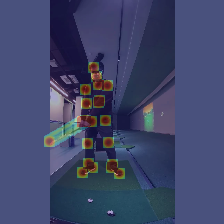
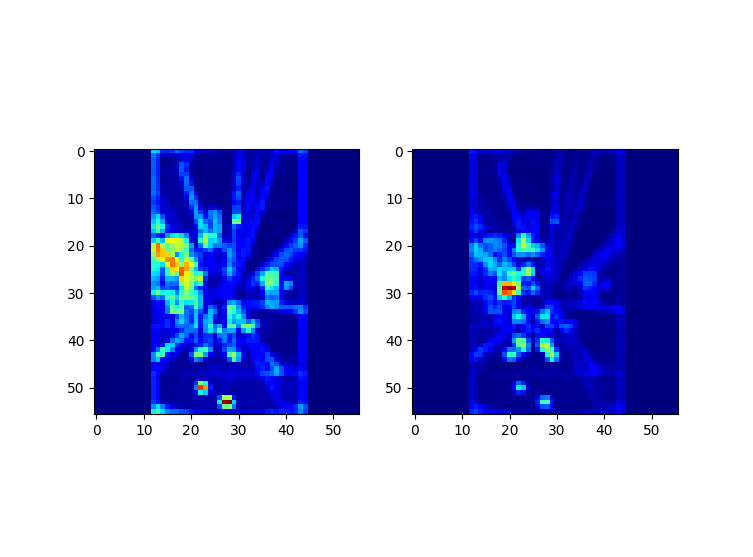
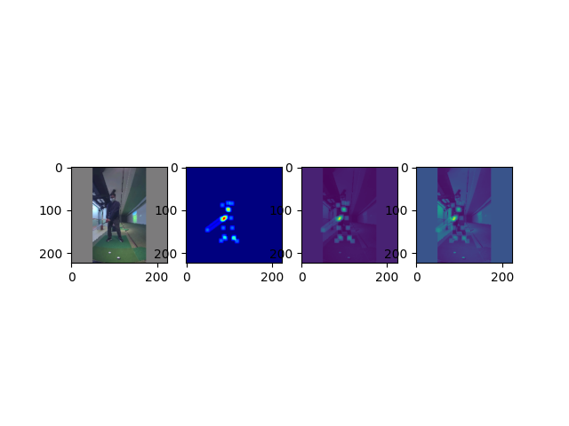

# Under development

## PoseNet으로 뽑은 히트맵



## ResNet-18 + LSTM 모델

```bash
---------------------------------------------------------------------------------------------------
           Layer (type)                               Output Shape         Param #     Tr. Param #
===================================================================================================
               Conv2d-1                        [384, 64, 112, 112]           9,408               0
          BatchNorm2d-2                        [384, 64, 112, 112]             128               0
                 ReLU-3                        [384, 64, 112, 112]               0               0
            MaxPool2d-4                          [384, 64, 56, 56]               0               0
           BasicBlock-5                          [384, 64, 56, 56]          73,984          73,984
           BasicBlock-6                          [384, 64, 56, 56]          73,984          73,984
           BasicBlock-7                         [384, 128, 28, 28]         230,144         230,144
           BasicBlock-8                         [384, 128, 28, 28]         295,424         295,424
           BasicBlock-9                         [384, 256, 14, 14]         919,040         919,040
          BasicBlock-10                         [384, 256, 14, 14]       1,180,672       1,180,672
          BasicBlock-11                           [384, 512, 7, 7]       3,673,088       3,673,088
          BasicBlock-12                           [384, 512, 7, 7]       4,720,640       4,720,640
   AdaptiveAvgPool2d-13                           [384, 512, 1, 1]               0               0
                LSTM-14     [6, 64, 512], [2, 6, 256], [2, 6, 256]       1,576,960       1,576,960
              Linear-15                                 [6, 64, 9]           4,617           4,617
===================================================================================================
Total params: 12,758,089
Trainable params: 12,748,553
Non-trainable params: 9,536
---------------------------------------------------------------------------------------------------
```

1st plan → ResNet-18 앞단의 CNN 레이어 (1~4) 까지 통과 한 아웃풋 (56x56)에 맞춰서 히트맵 사이즈를 맞춰서 resize한 뒤 summation해서 통과시키기

2nd plan → ResNet-18에 데이터를 인풋 하기 전에 (224x224)로 resize한 히트맵과 이미지를 summation 또는 concatenation 하여 ResNet 통과시키기

frozen은 Residual block 들어가기 전까지 해주는 것이 좋은 것 같다..!

## 1st idea



ResNet 앞단 CNN 통과 (왼쪽), 통과된 피처맵과 pose 히트맵 summation 결과 (오른쪽)

8/27 10:43 → 현재 224x224, seq_length=64, batch_size=8, frozen_layers=5 (GPU: GTX1080ti)

8/27 10:52 → 224x224, seq_length=64, batch_size=16, frozen_layers=5 (GPU: 서버 GPU, TITAN V)

## 2nd idea



맨 왼쪽: image
2번째: heatmap
3번째: image + heatmap (summation)
4번째: concatenate image and heatmap